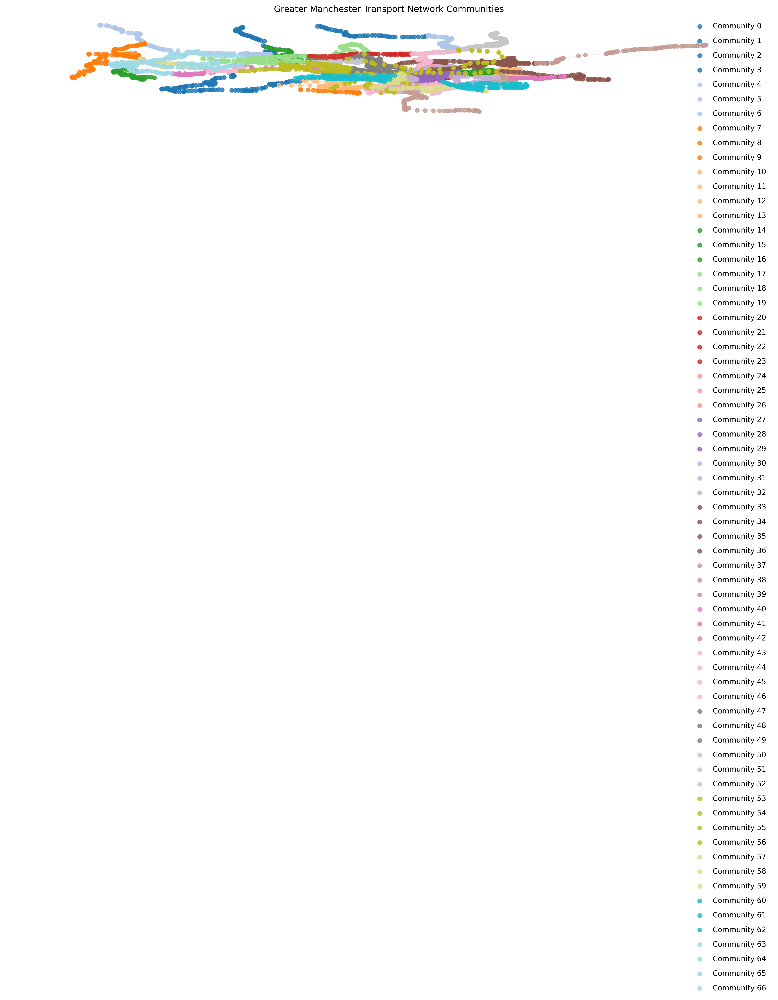

# Greater Manchester Transport Network Analysis



An advanced analytical framework for public transport networks, focusing on community detection, critical node identification, and equity analysis using graph theory and network science.

**Live Demo:** [View the Interactive Dashboard](https://al-kaisi.github.io/transport-network-analysis/)

## 📋 Table of Contents

- [Overview](#overview)
- [Features](#features)
- [System Architecture](#system-architecture)
- [Dashboard Examples](#dashboard-examples)
- [Getting Started](#getting-started)
- [Usage Guide](#usage-guide)
- [Dashboard Tabs](#dashboard-tabs)
- [Analysis Process](#analysis-process)
- [Optimisations](#optimisations)
- [Deployment](#deployment)
- [Contributing](#contributing)
- [Licence](#licence)

## 🌟 Overview

This project analyses Greater Manchester's public transport network to provide insights for transport planning, equity assessment, and resilience improvement. It transforms GTFS transit data into a network graph, where stops are nodes and connections are edges, then applies advanced network analysis techniques to extract meaningful patterns and insights.

The application is designed to help transport planners, local authorities, and community organisations make data-driven decisions about public transport improvements, with a focus on identifying service gaps and critical infrastructure.

## ✨ Features

- **Community Detection:** Identify naturally occurring transport service clusters
- **Critical Node Analysis:** Pinpoint the most important stops and stations for network resilience
- **Equity Gap Identification:** Highlight areas with insufficient transport services
- **Rich Visualisations:** Interactive maps, charts, and network graphs
- **Scenario Testing:** Simulate impact of network changes and service disruptions
- **Accessible UI:** Clear explanations for both technical and non-technical users
- **Performance Optimised:** Handles large transit networks with thousands of stops

## 🏗️ System Architecture

### System Architecture Diagram

```
┌───────────────────────────────────────────────────────────┐
│                Data Processing Layer                       │
│  GTFS Data Loading | Coordinate Processing | Data Sampling │
└───────────────────────────────────────────────────────────┘
                           ▼
┌───────────────────────────────────────────────────────────┐
│                Graph Analysis Layer                        │
│  Graph Construction | Community Detection | Centrality     │
└───────────────────────────────────────────────────────────┘
                           ▼
┌───────────────────────────────────────────────────────────┐
│                Domain Analysis Layer                       │
│  Equity Analysis | Accessibility | Temporal Patterns       │
└───────────────────────────────────────────────────────────┘
                           ▼
┌───────────────────────────────────────────────────────────┐
│                Symbolic AI Layer                           │
│  Knowledge Base | Logical Reasoning | Recommendations      │
└───────────────────────────────────────────────────────────┘
                           ▼
┌───────────────────────────────────────────────────────────┐
│                Visualisation Layer                         │
│  Interactive Dashboard | Plotly | NetworkX | Mapping       │
└───────────────────────────────────────────────────────────┘
```

The system follows a modular architecture:

1. **Data Processing Layer**
   - GTFS data loading and parsing
   - Geographic coordinates processing
   - Data sampling and filtering

2. **Graph Analysis Layer**
   - Network graph construction
   - Community detection algorithms
   - Centrality measures computation
   - Vulnerability assessment

3. **Domain Analysis Layer**
   - Transport equity analysis
   - Accessibility measurement
   - Temporal pattern identification
   - Service quality evaluation

4. **Visualisation Layer**
   - Interactive Dash dashboard
   - Plotly graph generation
   - NetworkX visualisations
   - Geographical mapping

5. **Symbolic AI Layer**
   - Knowledge base construction
   - Logical reasoning about network properties
   - Improvement recommendation generation

## 📸 Dashboard Examples

### Transport Network Communities

*The coloured clusters represent different transport communities - areas with strong internal connections.*

### Network Accessibility Heatmap

*This heatmap shows how accessible different areas are from one another. Darker colours indicate better connections between communities.*

### Critical Transport Nodes

*Highlights the most crucial transport hubs in the network, where disruption would cause the most significant impact.*

## 🚀 Getting Started

### Prerequisites

- Python 3.9+
- Git
- 8GB+ RAM (for full-scale analysis)

### Installation

1. Clone the repository:
   ```bash
   git clone https://github.com/AL-Kaisi/transport-network-analysis.git
   cd transport-network-analysis
   ```

2. Create and activate a virtual environment:
   ```bash
   python -m venv venv
   source venv/bin/activate  # On Windows: venv\Scripts\activate
   ```

3. Install dependencies:
   ```bash
   pip install -r requirements.txt
   ```

4. Set up environment variables (optional):
   ```bash
   cp .env.example .env
   # Edit .env file with your GTFS data source and preferences
   ```

## 📊 Usage Guide

### Running the Analysis

For full analysis with all features:
```bash
python scripts/run_analysis.py
```

For faster analysis with reduced sample size:
```bash
python scripts/run_analysis.py --sample-size=500
```

### Launching the Dashboard

Run the interactive dashboard:
```bash
python enhanced_dashboard.py
```

The dashboard will be available at http://127.0.0.1:9090 in your web browser.

## 📑 Dashboard Tabs

### 1. Network Overview
Shows high-level metrics about the transport network including number of stops, connections, communities detected, and network density. Includes a visualisation of the community structure and how communities connect to each other.

### 2. Communities
Provides detailed information about each identified community, including size, density, and geographic coverage. Shows a heatmap of accessibility between communities to highlight areas with poor connections.

### 3. Critical Nodes
Identifies the most important stops/stations in the network – those that, if disrupted, would have the largest impact on journey times and connectivity. Shows a visualisation with these nodes highlighted and ranked by importance.

### 4. Equity Analysis
Highlights equity gaps in the transport network, showing areas with poor service coverage, limited operating hours, or accessibility issues. Colour-coded by severity to help prioritise improvements.

### 5. Scenario Testing
Allows transport planners to simulate the impact of:
- Removing nodes (e.g., temporary station closures)
- Adding connections between communities
- Improving service in vulnerable areas

## 🔍 Analysis Process

1. **Data Loading:** Extract GTFS data (stops, routes, trips, stop_times)
2. **Graph Construction:** Build network representation with weighted edges
3. **Community Detection:** Apply Louvain method to identify densely connected groups
4. **Centrality Analysis:** Calculate betweenness centrality to find critical nodes
5. **Vulnerability Assessment:** Simulate node removals to test network resilience
6. **Equity Evaluation:** Compare service levels across geographic areas
7. **Visualisation Generation:** Create interactive maps and charts
8. **Knowledge Base Creation:** Convert graph properties to logical statements
9. **Symbolic Reasoning:** Draw conclusions about network strengths/weaknesses

## ⚡ Optimisations

For analysing large transport networks, the framework includes:

- **Graph Sampling:** Reduces computation by sampling from all trips
- **Parallel Processing:** Uses multiprocessing for compute-intensive tasks
- **Memory-Efficient Algorithms:** Uses NetworkX views to avoid full graph copies
- **Result Caching:** Stores intermediate results to speed up future runs
- **Approximation Algorithms:** Uses faster approximations for complex metrics

## 🌐 Deployment

### GitHub Pages Deployment

A static version of the dashboard is deployed to GitHub Pages:

```bash
python export_dashboard_to_html.py
```

This creates static HTML files in the `docs/` directory that can be hosted on GitHub Pages or any web server.

### Server Deployment

For deploying as a web service:

```bash
gunicorn enhanced_dashboard:server
```

## 🤝 Contributing

Contributions are welcome! Please feel free to submit a Pull Request.

1. Fork the repository
2. Create your feature branch (`git checkout -b feature/amazing-feature`)
3. Commit your changes (`git commit -m 'Add some amazing feature'`)
4. Push to the branch (`git push origin feature/amazing-feature`)
5. Open a Pull Request

## 📄 Licence

This project is licensed under the MIT Licence - see the LICENCE file for details.

---

## 🔗 Related Resources

- [Transport for Greater Manchester](https://tfgm.com/)
- [GTFS Reference](https://gtfs.org/reference/static)
- [NetworkX Documentation](https://networkx.org/documentation/stable/)
- [Dash Documentation](https://dash.plotly.com/)